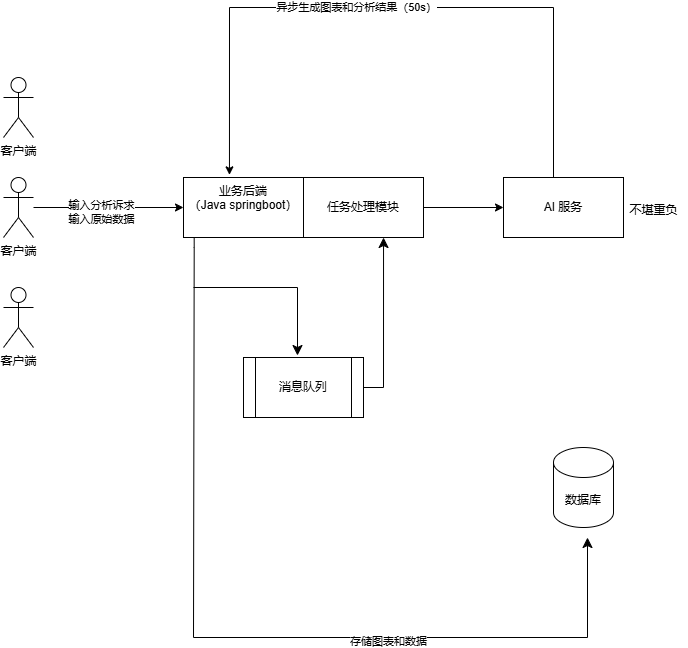
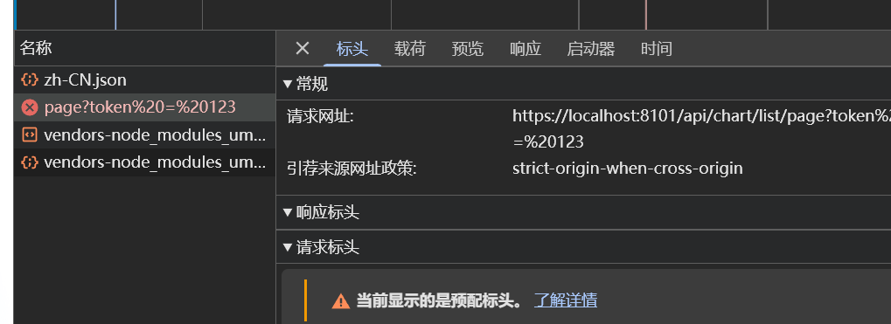

# 智能BI项目

## 项目介绍

BI 商业智能：数据可视化、报表可视化系统

主流 BI 平台：帆软 BI、小马 BI、微软 Power BI


### 传统 BI 平台：

https://chartcube.alipay.com/

特点：

1. 需要人工上传数据
2. 需要人工托选分析要用到的数据行和列（数据分析师）
3. 需要人工选择图表类型（数据分析师）
4. 生成图表（保存配置）


### 智能 BI 平台

区别于传统的 BI，用户（（数据分析者）只需要导入最最最原始的数据

，输入想要进行分析的目标（比如帮我分析一下网站的增长趋势），就能利用 AI 自动生成一个符合要求的图表以及结论。


优点：让不会数据分析的同学也能通过输入目标快速完成数据分析，大幅节约人力成本。会使用到 AI


### 需求分析

1. 智能分析：用户输入目标和原始数据（图表类型），可以自动生成图表和分析结论
2. 图表管理
3. 图表生成的异步化（消息队列）
4. 对接 AI 能力


### 架构图




### 技术栈

#### 前端

1. React
2. Umi + Ant Design Pro
3. 可视化开发库（Echarts + HighCharts + AntV）
4. umi openapi 代码生成（自动生成后端调用代码）

## 前端项目初始化


Ant Design Pro官方文档: https://pro.ant.design/zh-CN/docs/getting-started

> 如果初始化失败有可能是node.js 目录下的 node_global等三个文件夹的权限问题，需要在各个文件夹的属性 – > 安全 编辑User的控制权限


nvm 可以快捷切换 node.js 的版本


1. 按照官方文档初始化

2. 项目试运行（npm run dev / start）或者用yarn（推荐）

3. 代码托管（git）

4. 移除不必要的能力（比如国际化）

   

有问题找官方：https://github.com/ant-design/ant-design-pro/tree/master


解决国际化删除报错：

1. https://github.com/ant-design/ant-design-pro/issues/10452
2. 执行  `yarn add eslint-config-prettier`
   `yarn add eslint-plugin-unicorn`
3. 修改 node_modules/@umijs/lint/dist/config/eslint/index.js文件注释
   `// es2022: true`可以解决问题


## 前端调用后调

在前端 用户登录的index.tsx 文件调试用户登录

```tsx
  useEffect(() => {
    listChartByPageUsingPost({}).then(res => {
      console.error('res', res);
    })
  })
```


查看表头请求url是否为后端接口文档的端口号




如果不是就在前端更改对应的请求地址：在 app.tsx 里修改 request.baseURL


## 初始化项目-开发前准备

### 前端初始化的优化

.husky 提交代码时，检查是否规范


1) 修改端口为后端端口

2）删除 mock 数据（因为本地有后端）

3）替换图标，去 https://www.iconfont.cn/ 替换

4）删除国际化 locales 目录

5）删除测试相关目录

6）prettier、eslint、editorConfig、stylelint，需要开启 prettier 美化配置

7）替换标题（替换成自己喜欢的样子）


### 开发登录注册页面

 先删掉不需要的，再根据后端去做调整（和后端联调）

如果登录后还是没法进入主页，修改全局请求配置 app.tsx: 

```tsx
export const request: RequestConfig = {
  baseURL: 'http://localhost:8101',
  withCredentials: true,
  ...errorConfig,
};
```


修改 requestErrorConfig 文件，可以自定义全局请求响应拦截器

> 扩展：验证登录

```tsx
<Row gutter={8}>
          <Col span={16}>
            <FormItem
              name="captcha"
              rules={[
                {
                  required: true,
                  message: '请输入验证码!',
                },
              ]}
            >
              <Input size="large" placeholder="验证码" />
            </FormItem>
          </Col>
          <Col span={8}>
            <Button
              size="large"
              disabled={!!count}
              className={styles.getCaptcha}
              onClick={onGetCaptcha}
            >
              {count ? `${count} s` : '获取验证码'}
            </Button>
          </Col>
        </Row>
```


## 前端开发

### 输入的表单

文件上传时，注意去除原始对象

```tsx
const res = await genChartByAiUsingPost(params, {}, values.file.file.originFileObj);
```

### 生成图表

使用的库：[ECharts](https://git.hust.cc/echarts-for-react/)


## 开发图表管理功能（增删改查）

后端：复用 springboot - init 初始化模板的增删改查代码，核心：获取个人创建的图表列表 listMyChartByPage
前端：

1. 开发一个列表页
2. 支持按照图表名称搜索


步骤：

1. 创建路由和页面

2. 获取需要的数据，定义 state 变量来存储数据，用于页面展示

3. 先把最简单直观的数据展示给前端，再去调样式

4. 引入 Ant Design 的 List 组件，https://ant.design/components/list-cn，复制示例代码

5. 调整 List 组件中的内容为自己的样式（注意，获取用户头像可以从初始化状态中获取）

   ```tsx
   const { initialState } = useModel('@@initialState');
   const { currentUser } = initialState ?? {};
   ```

6. 针对样式，对数据做一些处理，比如统一隐藏图表自身的title

7. 增加分页

8. 增加搜索框

   ```tsx
   <div>
           <Search
             placeholder="请输入图表名称"
             style={{ width: 300, marginBottom: 12}}
             enterButton
             loading={loading}
             onSearch={(value) => {
               // 设置搜索条件
               setSearchParams({
                 ...initSearchParams,
                 name: value,
               });
             }}
           />
         </div>
   ```

9. 其他优化，比如 loading效果

小知识：

1. 原子化CSS
2. 利用 F12 控制台进行弱网测试


> 扩展点：1. 支持用户查看原始数据     2、支持跳转到图表编辑页，去编辑图表


## 前端开发

1. 复制一个异步创建图表页面
2. 修改一下调用的接口为异步接口
3. 移除无用元素和变量
4. 修改成功后的操作，比如提示语和重置表单
5. 调整我的图表页面，补充错误的处理
6. 调整图表的查询顺序，按照创建时间排序


